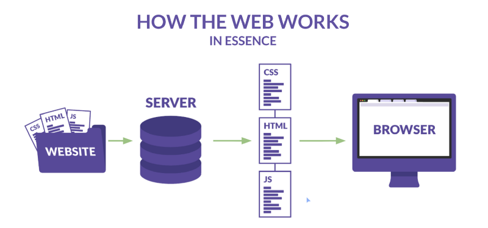
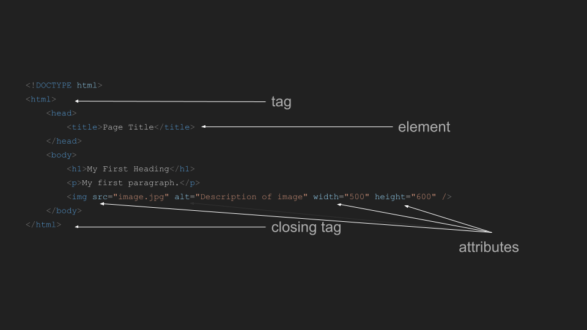

# The HTML lesson


## 1. What is it and why it's so important

HTML (Hypertext Markup Language) is the standard markup language used in webpages creation.
It is the <em>backbone</em> of any website we visit. 
HTML is the skeleton, the structure of the page, and along with CSS and JavaScript , makes up the triad of web technologies that the the World Wide Web relies on.

HTML is the language that web-browsers will read first, as welll as SEO and accesibility will be managed by the HTML content. 



The first file of the website should call "index.html", when you call for a website this should be the file returned to the browser.

### 1.1 Javascript and CSS Meanings.

Please note that JavaScript acts like the brain of your web application. It turns your static webpage into a dynamic page with interactive content and functionality. 
JavaScript allows you to manipulate HTML elements, handle user interactions, make API calls, and much more. It is a powerful language that enhances the user experience and adds interactivity to your website.

CSS also enables you to control the layout and presentation of your webpage. With CSS, you can define the positioning of elements, set the font styles, apply animations, and create responsive designs. It provides a wide range of selectors and properties that give you full control over the visual appearance of your website.


## 2. HTML Basic Structure, Elements and  Tags

```html
<!DOCTYPE html>
<html>
    <head>
        <title>Page Title</title>
    </head>
    <body>
        <h1>My First Heading</h1>
        <p>My first paragraph.</p>
        
    </body>
</html>
```

> Source: https://www.w3schools.com/html/html_intro.asp

This is the starting point of any webpage on the web.

This example starts with the `<!DOCTYPE html>`, this element is an exception of the rule, and only existis to tell the browsers that the file is an HTML file. 
The second line and above should always contain the <em>elements</em> and the <em>tags</em> in a format that allows open and close. In this example, as you can see the open of html tag (`<html>`) and the close of this tag (`</html>`)

HTML elements are just a single chuncks of code, with only text inside of it.

> Some tags could not have any close tag, if it does not have any content and only has <em>attributes</em>, like the `img` tag.
``

In the example before, you have:
- `<!DOCTYPE html>`: This declaration defines the document to be HTML5.
- `<html>`: The root element of an HTML page.
- `<head>`: The element contains meta-information about the HTML page.
- `<title>`: The element specifies a title for the HTML page (which is shown in the browser's title bar or in the page's tab).
- `<body>`: This contains the content of the page (visible to the user).
- `<h1>`: This defines a large heading.
- `<p>`: This defines a paragraph.
- ``: This defines an image, with attributes to add more information about this element..


... and you a lot of more tags, that we will describe latter

## 2.1 HTML Atrributes

HTML attributes allow to add information about HTML elements. They are always specified in the start tag and usually come in name/value pairs like `name="value"`. 



# 3 HTML main elements

The `head` tag and the `body` as differents proporses, so the elements for each tag will be diferent
The `head` tag contains information about website meta-information and the references for the Javascript and CSS files. It contains information that will not be displayed, but it's important for the web-browsers to parse the page and show it correctly.

Most commonly used elements inside the `<head>` tag are:
- `<title>`: Specifies the title of the document. The title is displayed in the browser's title bar or tab.
- `<meta>`: Provides metadata about the HTML document. Metadata will not be displayed on the page, but will be machine parsable. It can be used by browsers (how to display content or reload page), search engines (keywords), or other web services.
- `<link>`: Defines the relationship between the current document and an external resource. This tag is most used to link to style sheets.
- `<style>`: Used to include CSS rules within a document. This tag is used for internal CSS.
- `<script>`: Used to embed or reference an external JavaScript file.

The `body` tag represents the content of the webpage, and this content should be displayed to the user through the web browser.


Most commonly used elements inside the `<body>` tag are:
- `<header>`: Represents a container for introductory content or a set of navigational links.
- `<nav>`: Defines a set of navigation links.
- `<main>`: Specifies the main content of a document.
- `<article>`: Defines a self-contained composition in a document, which is intended to be independently distributable or reusable.
- `<section>`: Represents a standalone section of a document, which doesn't have a more specific semantic element to represent it.
- `<aside>`: Defines content aside from the content it is placed in. The aside content should be related to the surrounding content.
- `<footer>`: Represents a footer for a document or a section. It typically contains information about the author of the section, copyright data or links to related documents.
- `<figure>` and `<figcaption>`: The `<figure>` tag specifies self-contained content, like illustrations, diagrams, photos, code listings, etc. The `<figcaption>` element is used to provide a caption for a `<figure>` element.
- ``: This tag is used to embed an image in the HTML page. It has attributes like `src` (source of the image), `alt` (alternative text for the image), `width` and `height` (dimensions of the image).

# 4 HTML most used attributes

The most used used attributs, available for the almost types of tags, are: 

- `class`: Specifies one or more class names for an element. The class attribute is mostly used to point to a class in a style sheet.
- `id`: Specifies a unique id for an element. The id attribute is used to point to a style in a style sheet, or to manipulate the element with JavaScript.
- `style`: Specifies inline CSS style for an element.
- `title`: Specifies extra information about an element. This information often shows as a tooltip when you hover over the element.
- `lang`: Specifies the language of the element's content.
- `dir`: Specifies the text direction for the content in an element.
- `tabindex`: Specifies the tabbing order of an element.
- `accesskey`: Specifies a shortcut key to activate/focus an element.
- `hidden`: Specifies that an element is not yet, or is no longer, relevant.
- `contenteditable`: Specifies whether the content of an element is editable or not.


After that, you have the event attributs to, commonly start with the `on`, like `onClick` or `onFocus`. They should call some Javascript function. Here is a quick list of the most used Event Attributs
- `onclick`: The script is executed when the element is clicked.
- `ondblclick`: The script is executed when the element is double-clicked.
- `onmousedown`, `onmouseup`, `onmouseover`, `onmouseout`, `onmousemove`: These events are related to the mouse actions on an element.
- `onkeydown`, `onkeypress`, `onkeyup`: These events are triggered by a keyboard action on an element.
- `onload`: The script is executed when the element has finished loading.
- `onresize`: The script is executed when the window is resized.
- `onscroll`: The script is executed when the element's scroll position changes.
- `onfocus`: The script is executed when the element gets focus.
- `onblur`: The script is executed when the element loses focus.
- `onchange`: The script is executed when the element changes.
- `onsubmit`: The script is executed when the form is submitted.

HTML attributs could related with the accessibility of web content and web applications. They are called ARIA attributes, and stands for `Accessible Rich Internet Applications`.
These attributes can be added to HTML elements to provide additional information about the functionality and behavior of these elements, especially for people who use assistive technology like screen readers.
- `aria-label`: Provides an accessible name for an object.
- `aria-labelledby`: Provides an accessible name for an object via the id of another element.
- `aria-hidden`: Indicates whether the element is exposed to an accessibility API.
- `aria-checked`: Indicates the checked state of a checkbox or radio button.
- `aria-expanded`: Indicates whether a collapsible element is currently expanded or collapsed.
- `aria-required`: Indicates that user input is required on an element before a form can be submitted.
- `aria-invalid`: Indicates the validation state of an element.
- `aria-controls`: Identifies the element (or elements) whose contents or presence are controlled by the current element.

## 5. HTML Elements in deep
### 5.1 Text Elements

HTML text elements are used to structure the content in the body of an HTML document. Here are some commonly used text elements:

- `<p>`: Defines a paragraph.
- `<h1>` to `<h6>`: Define HTML headings, `<h1>` being the highest (or most important) and `<h6>` the lowest.
- `<strong>`: Defines important text.
- `<em>`: Defines emphasized text.
- `<b>`: Defines bold text.
- `<i>`: Defines italic text.
- `<small>`: Defines smaller text.
- `<mark>`: Defines marked or highlighted text.

Not so common to use, but you can use too:
- `<del>`: Defines text that has been deleted from a document.
- `<ins>`: Defines a text that has been inserted into a document.
- `<sub>` and `<sup>`: Define subscripted and superscripted text respectively.
- `<blockquote>`: Defines a section that is quoted from another source.
- `<q>`: Defines a short quotation.
- `<abbr>`: Defines an abbreviation or an acronym.
- `<cite>`: Defines the title of a work.
- `<dfn>`: Represents the defining instance of a term.
- `<address>`: Defines contact information for the author/owner of a document or an article.
- `<pre>`: Defines preformatted text.
- `<code>`: Defines a piece of computer code.
- `<samp>`: Defines sample output from a computer program.
- `<kbd>`: Defines keyboard input.
- `<var>`: Defines a variable.
- `<time>`: Defines a date/time.

### 5.2 List Elements

HTML provides several elements for defining lists of items. Here are the most commonly used ones:
- `<ul>`: Unordered list. It's used when the order of items doesn't matter. Each item in the list starts with a bullet point.
- `<ol>`: Ordered list. It's used when the order of items does matter. Each item in the list starts with a number or letter.
- `<li>`: List item. It's used within `<ul>` or `<ol>` to define each item in the list.
- `<dl>`: Description list. It's used to display name/value groups, like terms and definitions. It's often used in conjunction with `<dt>` (description term) and `<dd>` (description data).

Using these list elements helps to structure your HTML document. They make it easier for users to read and understand the content, especially when you have a list of items. They also help search engines understand the content on your page, which can improve SEO.

### 5.3 Link elements
Hyperlinks in HTML are used to link from one page to another. They are defined using the `<a>` tag. The destination of the hyperlink is specified in the href attribute.

Hyperlinks in HTML are defined with the `<a>` tag. The `<a>` tag uses the following attributes:

- `href`: Specifies the URL of the page the link goes to.
- `target`: Specifies where to open the linked document. Common values are `_blank` (opens the linked document in a new window or tab) and `_self` (opens the linked document in the same frame as it was clicked, this is default).
- `download`: Specifies that the target will be downloaded when a user clicks on the hyperlink.
- `rel`: Specifies the relationship between the current document and the linked document.


Example usage:
```html
<a href="https://www.example.com" target="_blank" rel="noopener noreferrer">Visit Example.com</a>
```

This creates a link that says "Visit Example.com". When clicked, it opens www.example.com in a new browser tab or window. The `rel="noopener noreferrer"` attribute is a security measure that prevents the new page from being able to access the window object of the original page, which could potentially lead to malicious behavior.

Hyperlinks can also be used to link to different sections within the same page, to email addresses (using `mailto:` ), and to phone numbers (using `tel:`).

### 5.4 Images

To place images in html, we should use the image element `img` inside of a figure element. 

- Images: Images in HTML are embedded using the `` tag. The `` tag is self-closing, meaning it doesn't need a closing tag. It uses the src attribute to specify the source file for the image, and the alt attribute to specify alternative text to be displayed if the image cannot be loaded.
Example:
```html

```

Figures: The `<figure>` element in HTML is used to encapsulate media such as images, diagrams, code listings, etc., along with their caption. The `<figcaption>` element is used within the `<figure>` element to provide a caption for the media.
Example:
```html
<figure>
  
  <figcaption>A caption for the image</figcaption>
</figure>
```
In this example, the `<figure>` element contains an `` element and a `<figcaption>` element. The image is displayed with a caption underneath it.

Using the `<figure>` and `<figcaption>` elements helps improve the semantic structure of your HTML document, making it easier for both users and search engines to understand the context and significance of your images.

## 5.5 Tables

HTML tables are defined with the `<table>` tag. A table is divided into rows (with the <tr> tag), and each row is divided into data cells (with the `<td>` tag). The letters "td" stand for "table data," which is the content of a data cell. A `<td>` tag can contain text, links, images, lists, forms, other tables, etc.

Here's a basic example of an HTML table:
```html
<table>
  <tr>
    <td>Row 1, Cell 1</td>
    <td>Row 1, Cell 2</td>
  </tr>
  <tr>
    <td>Row 2, Cell 1</td>
    <td>Row 2, Cell 2</td>
  </tr>
</table>
```

In addition to basic table elements, there are several others that improve the structure and design of your tables:

The `<th>` element is used for table headings (the cell is displayed in bold and centered by default).
The `<thead>`, `<tbody>`, and `<tfoot>` elements allow you to group the header content, the body content, and the footer content of a table, which can be useful for applying styles and improving performance.
The colspan and rowspan attributes can be used on a `<td>` or `<th>` to make it span more than one column or row.
Tables should be used when you need to present data in a tabular format. They should not be used for layout purposes, as this can lead to accessibility issues and can make your web pages difficult to maintain.

